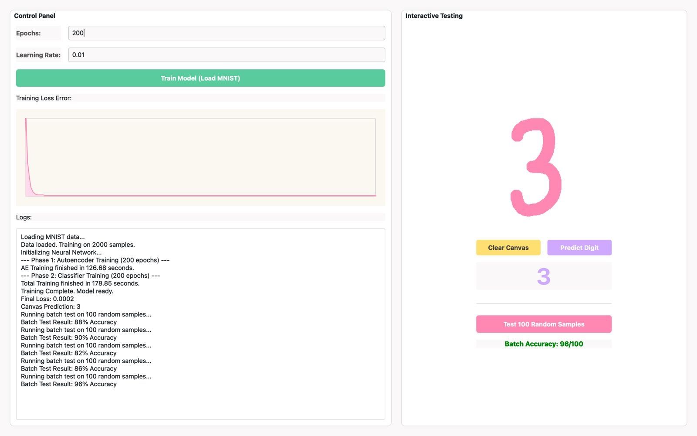

# Handwritten Digit Recognition using a Neural Network from Scratch

<p align="center">
  
</p>

> A desktop application for handwritten digit recognition using a neural network implemented entirely from scratch in **C++**, featuring autoencoder pretraining, supervised classification, and an interactive **PySide6** interface.

<p align="center">


</p>

---

# Overview

This project is a desktop application for handwritten digit recognition built around a neural network implemented entirely from scratch in C++.

Instead of relying on high-level deep learning frameworks for model creation and training, the neural network—including weight initialization, feedforward propagation, backpropagation, softmax classification, momentum optimization, and autoencoder pretraining—was manually developed in C++.

Python is used for the graphical user interface, dataset loading, and interaction with the custom C++ neural network through a wrapper module.

---

# Features

- Neural network implemented from scratch
- Autoencoder pretraining
- Feedforward propagation
- Backpropagation
- Softmax output layer
- Cross-Entropy loss
- Momentum optimization
- He weight initialization
- MNIST dataset support
- Interactive drawing canvas
- Real-time handwritten digit prediction
- Batch evaluation on random test samples
- Training loss visualization
- Python–C++ integration
- Desktop graphical interface using PySide6

---

# Technology Stack

- Python
- C++
- PySide6 (Qt for Python)
- NumPy
- TensorFlow (MNIST dataset loading only)
- Custom C++ Neural Network
- Python/C++ Wrapper Module

---

# Neural Network Architecture

```text
Input Layer (784)

        │
        ▼

Hidden Layer (128)
Sigmoid Activation

        │
        ▼

Output Layer (10)
Softmax Classification
```

---

# Training Pipeline

```text
MNIST Dataset
        │
        ▼
Data Normalization
        │
        ▼
Autoencoder Pretraining
        │
        ▼
Encoder Weight Transfer
        │
        ▼
Supervised Classifier Training
        │
        ▼
Feedforward
        │
        ▼
Cross-Entropy Loss
        │
        ▼
Backpropagation
        │
        ▼
Momentum Weight Updates
        │
        ▼
Trained Model
```

---

# From Scratch Implementation

Unlike many handwritten digit recognition projects that rely on pre-built deep learning models, this project implements the core neural network algorithms manually.

Implemented components include:

- Feedforward propagation
- Backpropagation
- Autoencoder pretraining
- Softmax activation
- Cross-Entropy loss
- Momentum optimization
- He weight initialization
- Weight and bias updates
- Neural network inference
- MNIST digit classification

TensorFlow is used **only to download and load the MNIST dataset**. The neural network architecture, training process, optimization, and prediction logic are fully implemented in C++.

---

# Dataset

**MNIST Handwritten Digit Dataset**

- 60,000 training images
- 10,000 testing images
- Image resolution: 28 × 28 pixels
- 10 output classes (digits 0–9)

---

# Screenshots

## Training Interface

Train the neural network, monitor the loss curve, and evaluate the model through the graphical interface.

<p align="center">
    
</p>

---

## Interactive Digit Recognition

Draw a handwritten digit on the canvas and let the trained neural network predict the corresponding number in real time.

<p align="center">
    
</p>

---

# Educational Objectives

This project was developed to understand the internal mechanics of neural networks by implementing every stage of the learning process manually.

The implementation covers:

- Neural Networks
- Autoencoders
- Feedforward Propagation
- Backpropagation
- Cross-Entropy Optimization
- Softmax Classification
- Momentum Optimization
- Weight Initialization
- Handwritten Digit Recognition

---

# Future Improvements

- Multiple hidden layers
- ReLU activation support
- Adam optimizer
- Dropout regularization
- Learning rate scheduling
- Model serialization
- GPU acceleration
- Support for additional handwritten datasets (EMNIST)

---

# Developer

Developed by

**Kübra Atlan**

---

# License

This repository is shared for educational and portfolio purposes.

The source code is publicly available for learning, research, and demonstration of custom neural network implementations.
